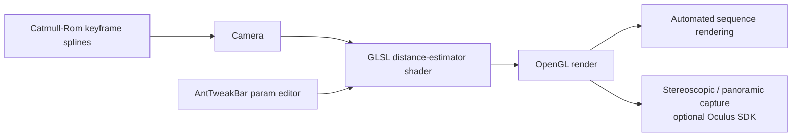

# 3DFractals Architecture

## Render pipeline

```mermaid
flowchart LR
    Cam[Camera] --> Glsl[GLSL distance-estimator shader]
    Glsl --> GL[OpenGL render]
    KF[Catmull-Rom keyframe splines] --> Cam
    ATB[AntTweakBar param editor] --> Glsl
    GL --> Seq[Automated sequence rendering]
    GL --> Stereo[Stereoscopic / panoramic capture<br/>optional Oculus SDK]
```
